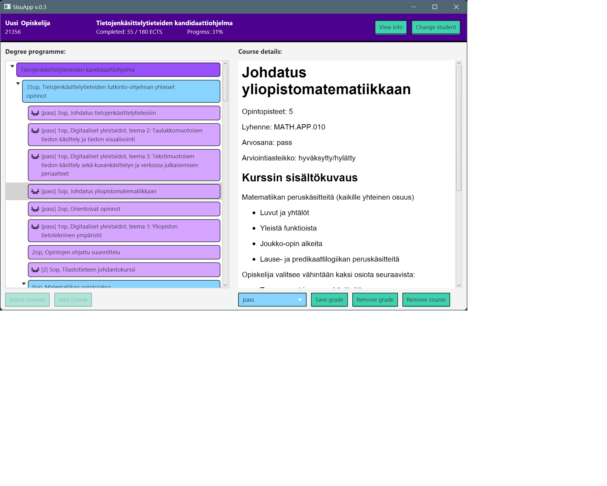

# Programming 3: SISU project by group 2547

(c) Antti Hakkarainen, Heikki Hohtari, Kilian Kugge 2023

This project implements an application that can be used for tracking one's
studies in Tampere university's programmes. Users can create different users
with separate studies and add courses of their choosing and mark the grades they
have received from those courses.

The main aims of this project from a programming perspective were to create a full fledged
application with a GUI that makes actual API calls to a server and can store the
data in a JSON format, and read it back from the file. Learning object-oriented design
and concepts was also a major focus of the project.

Technologies used:

- Java, for all coding
- Maven, for building and dependency management
- JavaFX, for the GUI
- JUnit, for testing
- Jackson, for JSON serialization and deserialization
- Checkstyle, for checking code style
- JaCoCo, for checking test coverage

Program was structured using the Model-View-ViewModel pattern.

